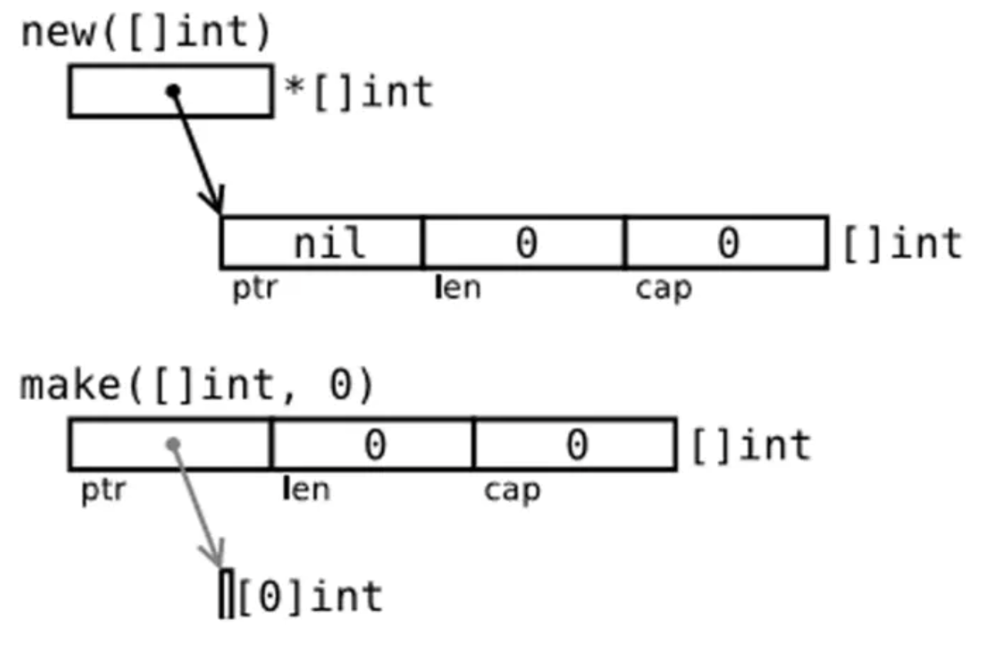

- go语言的`new`用法

  new用来分配内存，但与其他语言中的同名函数不同，它不会**初始化**内存，只会讲内存**置零**；也就是说，new(T)会为类型为T的新项分配已置零的内存空间，并返回他的地址，也就是一个类型为*T的值。用Go的术语来说，它返回一个指针，改指针指向新分配的，类型为T的零值

- `make`的用法

  make的目的不同于new，它只用于slice,map,channel的创建，并返回类型为T（非指针）的**已初始化（非零值）**的值；出现这种差异的原因在于，这三种类型本质上为引用类型，它们在使用前必须初始化；

- new和make都在堆上分配内存，但是它们的行为不同，适用于不同的类型。

  new(T) 为每个新的类型T分配一片内存，初始化为 0 并且返回类型为*T的内存地址：这种方法 **返回一个指向类型为 T，值为 0 的地址的指针**，它适用于值类型如数组和结构体；它相当于 &T{}。

  make(T) **返回一个类型为 T 的初始值**，它只适用于3种内建的引用类型：slice、map 和 channel。

  换言之，new 函数分配内存，make 函数初始化；下图给出了区别：

  

  通过实验也可以看出两者的区别：

  ```go
  package main
  
  import "fmt"
  
  func main() {
      p := new([]int) //p == nil; with len and cap 0
      fmt.Println(p)
  
      v := make([]int, 10, 50) // v is initialed with len 10, cap 50
      fmt.Println(v)
  
      /*********Output****************
          &[]
          [0 0 0 0 0 0 0 0 0 0]
      *********************************/
  
      (*p)[0] = 18        // panic: runtime error: index out of range
                          // because p is a nil pointer, with len and cap 0
      v[1] = 18           // ok
      
  }
  ```

  